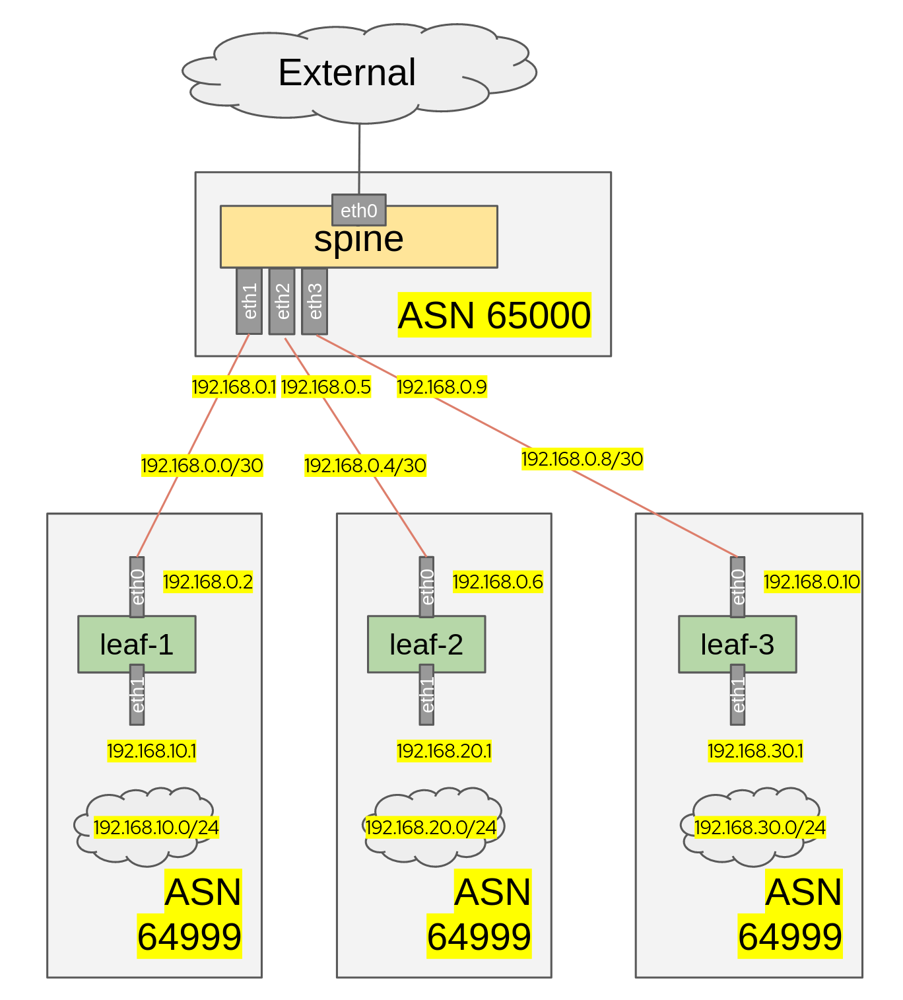

## Simple PoC for BGP

This is a set of Ansible tasks that will deploy BGP gateways in a virtualized Spine & Leaf environment,
running on against an OpenStack cloud.




It is opinionated and is being used to prototype an environment where OpenShift control plane will be deployed in multiple leaves, on top of OpenStack, routed with BGP thanks to FRR.


## How to deploy

1. (Optional) Create `localvars.yaml` file and put your environment specicics, like `cloud_name`, etc.

2. Run the following command:

```bash
make deploy
```


## How to undeploy

```
make undeploy
```
